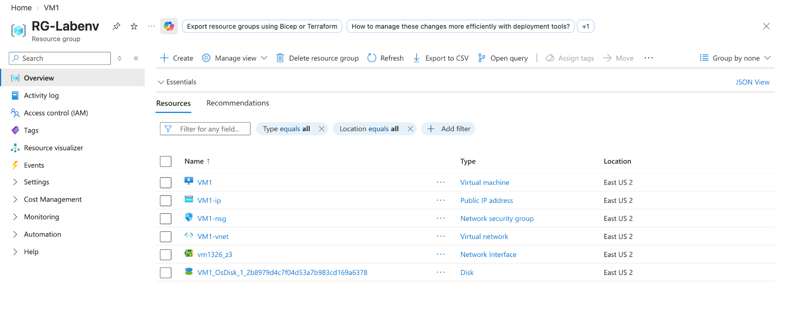
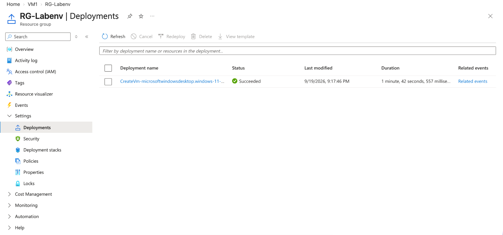
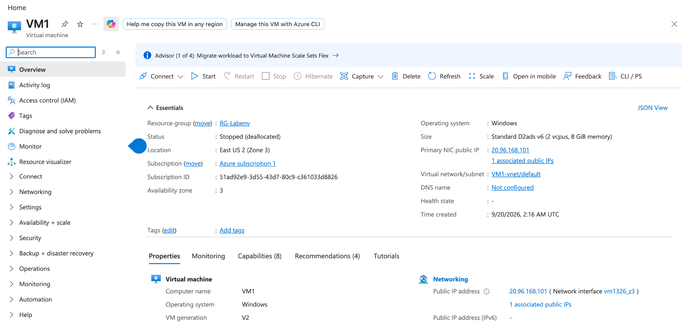
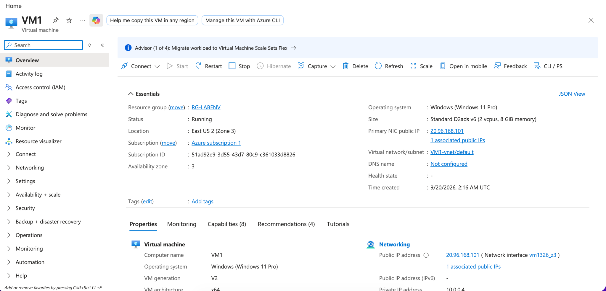
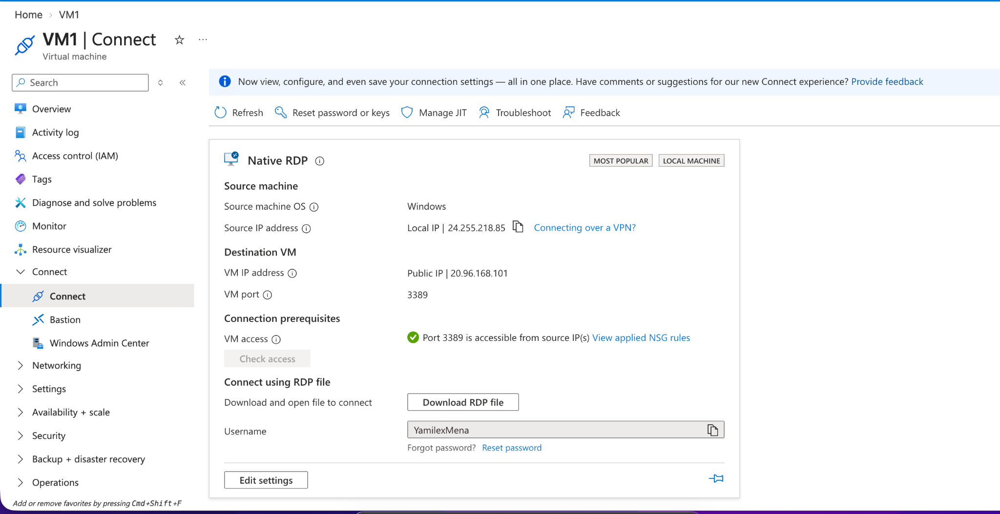
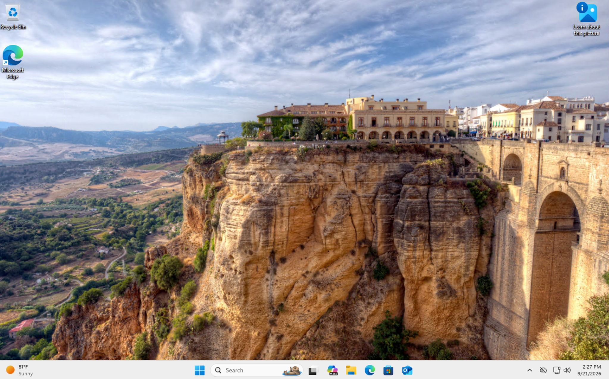
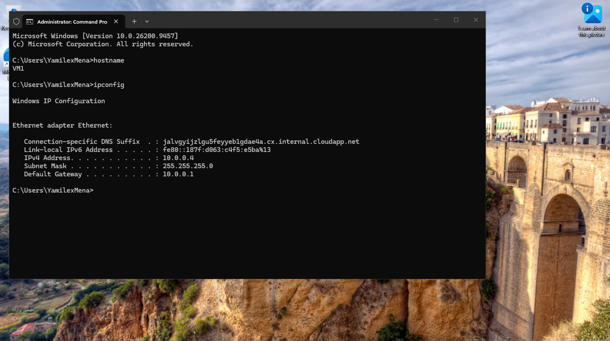

# Azure Resource Group, Virtual Machine Deployment & RDP

## Objective

Review and manage an Azure Windows virtual machine, verify its supporting resources, confirm RDP access, and validate the remote system.

## Step 1: Review the Resource Group

Reviewed the Azure resource group and identified the resources supporting the virtual machine.

## Step 2: Verify the VM Deployment

Confirmed that the virtual machine deployment completed successfully.

## Step 3: Review the Virtual Machine

Reviewed the VM configuration, including the operating system, region, size, and networking information.

## Step 4: Start the Virtual Machine

Started the VM and confirmed that its status changed to **Running**.

## Step 5: Verify RDP Access

Confirmed that **port 3389** was accessible for Remote Desktop connectivity.

## Step 6: Connect to the Windows VM

Successfully connected to the Windows virtual machine using Remote Desktop.

## Step 7: Verify the Remote System

Used `hostname` and `ipconfig` to verify the VM identity and private IP address from inside the remote session.

## Skills Demonstrated

- Microsoft Azure
- Azure Virtual Machines
- Resource Group Management
- Virtual Networking
- Remote Desktop Protocol (RDP)
- Windows Administration
- Deployment Verification
- Cloud Infrastructure
